  
  
  
  

## ✦ About

I am Imran, a systems-minded full-stack builder working at the intersection of AI agents, human-centred interaction, and production software. I care about the unglamorous parts that decide whether a product earns trust: clear domain models, permission boundaries, durable workflows, observable failures, and interfaces shaped around real work.

My current direction is simple: make sophisticated systems feel dependable to the people using them.

## ▣ Selected work

| System | What it demonstrates | Engineering surface |
| --- | --- | --- |
| [LCIMS Cloud](https://lcims.imranjan.me/login) | A multi-tenant evolution of a real-estate operating system | Module entitlements, RBAC, approvals, documents, deployment scripts, regression-focused delivery |
| [YaQut OA](https://yaqut.imranjan.me/) | A workflow-first office-automation platform | Next.js, NestJS, Prisma, PostgreSQL, auditability, notifications, attachments |
| [Yigui](https://github.com/narmi924/YiguiApp) + [server](https://github.com/narmi924/yigui-server) | Virtual try-on and interaction experiments that cross mobile, CV, and backend systems | Swift, FastAPI, workers, 3D model processing, Nginx deployment |
| [mengsheng-cup-2024](https://github.com/narmi924/mengsheng-cup-2024) | A public embedded sound-source localisation project | STM32H7, embedded C, Python analysis, MATLAB TDOA simulation, multi-microphone signal processing |
| [AccessAudit](https://github.com/narmi924/AccessAudit) | A deliberately small experiment in verifiable approvals | Solidity, Foundry, role-based events, hashed audit payloads |

## ↗ Open source

I also work upstream, where reliability usually becomes visible only after things fail. The contribution signal below live-counts public activity and open upstream PRs; these are the projects currently in focus:

| Project | Active PRs | Focus |
| --- | ---: | --- |
| [agent-browser](https://github.com/vercel-labs/agent-browser/pulls?q=is%3Apr+author%3Anarmi924) | Current upstream work | CDP-session resilience, HAR capture, CLI error contracts, browser-state restoration |
| [native](https://github.com/vercel-labs/native/pulls?q=is%3Apr+author%3Anarmi924) | Current upstream work | Windows portability, image-cache test compilation, markup-server correctness, build validation |

<strong>Recent upstream PR ledger — snapshot: 2026-08-27</strong>

 

**agent-browser**

- [#1655 — Ignore vanished CDP sessions during setup](https://github.com/vercel-labs/agent-browser/pull/1655)
- [#1654 — Clear page error log](https://github.com/vercel-labs/agent-browser/pull/1654)
- [#1590 — Preserve HAR capture after export failure](https://github.com/vercel-labs/agent-browser/pull/1590)
- [#1576 — Preserve JSON for startup errors](https://github.com/vercel-labs/agent-browser/pull/1576)
- [#1574 — Restore storage before page scripts](https://github.com/vercel-labs/agent-browser/pull/1574)
- [#1573 — Report storage-restore failures](https://github.com/vercel-labs/agent-browser/pull/1573)
- [#1572 — Propagate launch init scripts to new targets](https://github.com/vercel-labs/agent-browser/pull/1572)

**native**

- [#171 — Make image-cache tests compile on Windows](https://github.com/vercel-labs/native/pull/171)
- [#159 — Use UTF-16 positions in the markup language server](https://github.com/vercel-labs/native/pull/159)
- [#158 — Run the core package gate on Windows](https://github.com/vercel-labs/native/pull/158)
- [#157 — Make build validation portable on Windows](https://github.com/vercel-labs/native/pull/157)

## ▦ Contribution record

## ⌘ Toolbox

  
   
  

Beyond the main stack: agent workflows, computer vision, MediaPipe, STM32, 3D interaction.

---

<em>For a system to earn trust, it must keep its promises when the happy path ends.</em>

