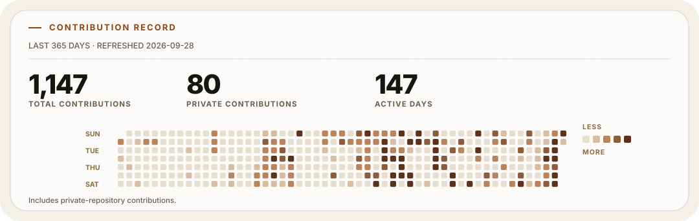

  <picture>
    <source media="(prefers-color-scheme: dark)" srcset="./assets/profile-header-dark.svg" />
    
  </picture>

<picture>
  <source media="(prefers-color-scheme: dark)" srcset="./assets/contribution-signal-dark.svg" />
  
</picture>

I'm Imran, a developer in Singapore, studying for the [Graduate Diploma in Systems Analysis at NUS-ISS](https://www.iss.nus.edu.sg/graduate-programmes/programme/detail/graduate-diploma-in-systems-analysis) and just wrapping up a full-stack internship at SAP.

I like building things that have to hold up in someone else's hands: agents that check with a person before they act, business software with a lot of rules, and now and then something with a camera or a microphone attached. Most days that means Python and TypeScript.

More at [imranjan.cn](https://imranjan.cn) and on [LinkedIn](https://linkedin.com/in/imranjan7).

 

## Hackathons

- **[Bring Your Own Factory](https://github.com/narmi924/byof-agent)**, NUS-ISS / AWS Show Me Your Agents Hackathon 2026 with team LIZZ, *in progress*  
  A production-planning agent that reschedules a factory only after the manager approves a plan. [Demo video](https://www.youtube.com/watch?v=Ul6LUf-bLsM)  
  `Python`&nbsp;`LangGraph`&nbsp;`OR-Tools`
- **[Shopping Copilot](https://github.com/narmi924/shopping-copilot)**, TikTok TechJam 2026, Track 4  
  Conversational shopping search that asks back when a request is vague and runs offline without a language model. It found the right product in the top ten for 94% of the 200 public test conversations, against 12.5% for the official baseline.  
  `Python`&nbsp;`FastAPI`&nbsp;`React`

## Projects

- **[LCIMS Cloud](https://lcims.imranjan.me/login)**: real-estate management software rebuilt so several companies share one deployment, each with its own modules, roles and approvals `FastAPI`&nbsp;`Vue`&nbsp;`PostgreSQL`
- **[Look2Act](https://drive.google.com/file/d/12MltCXOCFPti7GvGVxwfDP8TuD26sUZG/view?usp=sharing)**: webcam eye tracking where looking at something long enough clicks it, with a [gaze dataset collector](https://github.com/narmi924/gaze_dataset_collector) and a [demo](https://drive.google.com/file/d/1DjjuPsoB7M3zJUS3Ohix-e2r6DbhTU0c/view?usp=sharing) `PyTorch`&nbsp;`ONNX Runtime`&nbsp;`MediaPipe`
- **[YaQut OA](https://yaqut.imranjan.me/)**: office automation built around approval workflows, with an audit trail `Next.js`&nbsp;`NestJS`&nbsp;`PostgreSQL`
- **[Sound source localisation](https://github.com/narmi924/mengsheng-cup-2024)**: an STM32H7 microphone array that works out where a sound comes from, built for the 2024 Mengsheng Cup `C`&nbsp;`MATLAB`
- **[Yigui](https://github.com/narmi924/YiguiApp)** and its [server](https://github.com/narmi924/yigui-server): an iOS app for designing clothes on a 3D model of your own body and trying them on `Swift`&nbsp;`FastAPI`
- **[AccessAudit](https://github.com/narmi924/AccessAudit)**: a small experiment that records approvals as on-chain events you can verify later `Solidity`&nbsp;`Foundry`

## Open source

I send fixes to two Vercel Labs projects, mostly around browser reliability, Windows support and developer tooling.

<!-- upstream-prs:start -->

- 7 open pull requests to [agent-browser](https://github.com/vercel-labs/agent-browser/pulls?q=is%3Apr+author%3Anarmi924) on CDP sessions that disappear mid-setup, HAR capture, JSON error output and restoring saved browser state
- 4 open pull requests to [native](https://github.com/vercel-labs/native/pulls?q=is%3Apr+author%3Anarmi924), mostly to get the build and tests running on Windows, plus a position fix in the markup language server

Recent pull requests

**agent-browser**

- [#1655](https://github.com/vercel-labs/agent-browser/pull/1655) fix(network): ignore vanished CDP sessions during setup (open)
- [#1654](https://github.com/vercel-labs/agent-browser/pull/1654) fix(errors): clear page error log (open)
- [#1590](https://github.com/vercel-labs/agent-browser/pull/1590) fix(har): preserve capture after export failure (open)
- [#1572](https://github.com/vercel-labs/agent-browser/pull/1572) fix(native): propagate launch init scripts to new targets (open)
- [#1576](https://github.com/vercel-labs/agent-browser/pull/1576) fix(cli): preserve JSON for startup errors (open)
- [#1573](https://github.com/vercel-labs/agent-browser/pull/1573) fix(state): report storage restore failures (open)
- [#1574](https://github.com/vercel-labs/agent-browser/pull/1574) fix(state): restore storage before page scripts (open)

**native**

- [#171](https://github.com/vercel-labs/native/pull/171) Make image cache tests compile on Windows (open)
- [#157](https://github.com/vercel-labs/native/pull/157) Make build validation portable on Windows (open)
- [#158](https://github.com/vercel-labs/native/pull/158) Run the core package gate on Windows (open)
- [#159](https://github.com/vercel-labs/native/pull/159) Use UTF-16 positions in the markup language server (open)

<!-- upstream-prs:end -->
